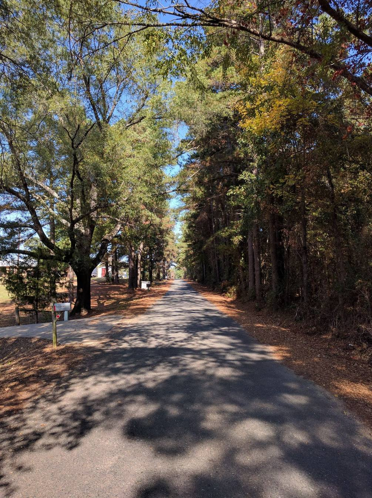
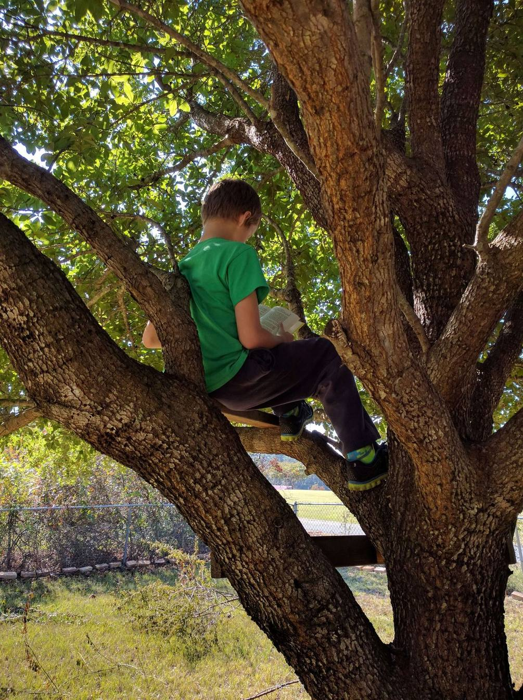

Five years ago this week I moved my family to a ranch-style house in the *country*.  We left the busy, but convenient lifestyle of constant traffic, public transit, frozen yogurt, city parks, nearby airports, local jobs, and tiny yards.

## Land You Could Love

What we fell in love with was the location and the yard.  It's at the end of a country road, half a mile from the small highway that's about 5 miles from the interstate to the nearest town.  Our road is a straight and narrow paved road with tall trees on either side that completely touch above the road forming a green tunnel in the summer.

We live in north-east Texas, which if you don't know is gulf coastal plains covered in thick forest.  No mountains, no natural lakes, just flat land, low elevation and lots of trees.  Out little 2-acre lot at the end of the road was mostly cleared some time ago and has large trees scattered across it giving us about 50% shade coverage and complete access to the grounds.

## Where we Came From

With education pursuits and career shifts, my family was in several places our first few years of marriage.

Previously we were living in a tiny 3-bedroom house in Sunnyvale, CA with a "backyard" about the size of our new living room.  Before that we were in a tiny upstairs apartment in downtown Palo Alto, CA.  And before that we were living in a small condo near Dallas, TX.

Now lest you think we're always been in the city before this house. I can go back farther and we lived in Texarkana, AR in a small house with a couple acres.  Our first place when we were married was an apartment in Magnolia, AR.

But by the time we moved here, all my kids could remember was the *city*.

## Living on the Land

We *live* in this house to its fullest.  The kids are home schooled and I work from home since there are no local jobs for programming.

This blog is a story of our adventures in our secluded corner of the world.  When we moved here five years ago we had two children.  Two more have since been born at home and another is due next March.

The best part of having large amounts of land (by city standards) is using that land for good.  I plan to talk about our gardens, construction projects, solar experiments, farm animals, electric tools (to complement the solar of course).  We'll talk about tornadoes and thunderstorms, droughts and floods, bugs and critters.  I might even throw in some programming and robotics combined with the gardening and off-grid services.

I'm a software developer by trade, creator by nature.  Basically this blog is about creating with a sprinkle of open source and tech.

