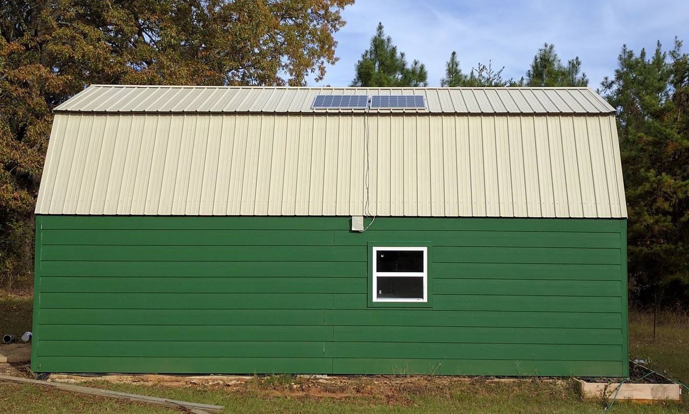
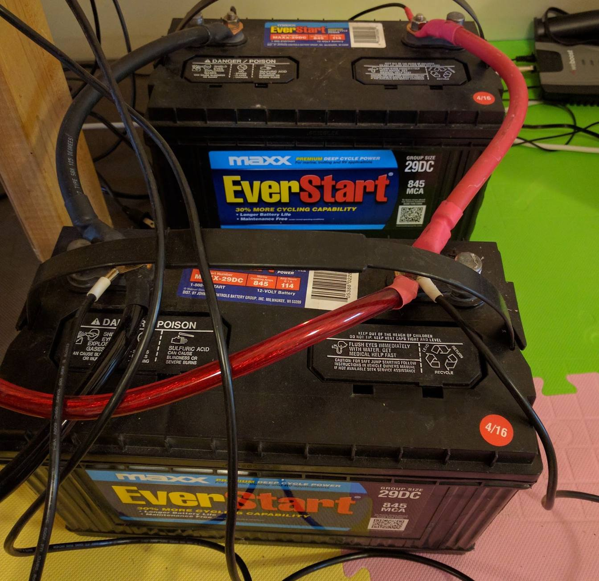
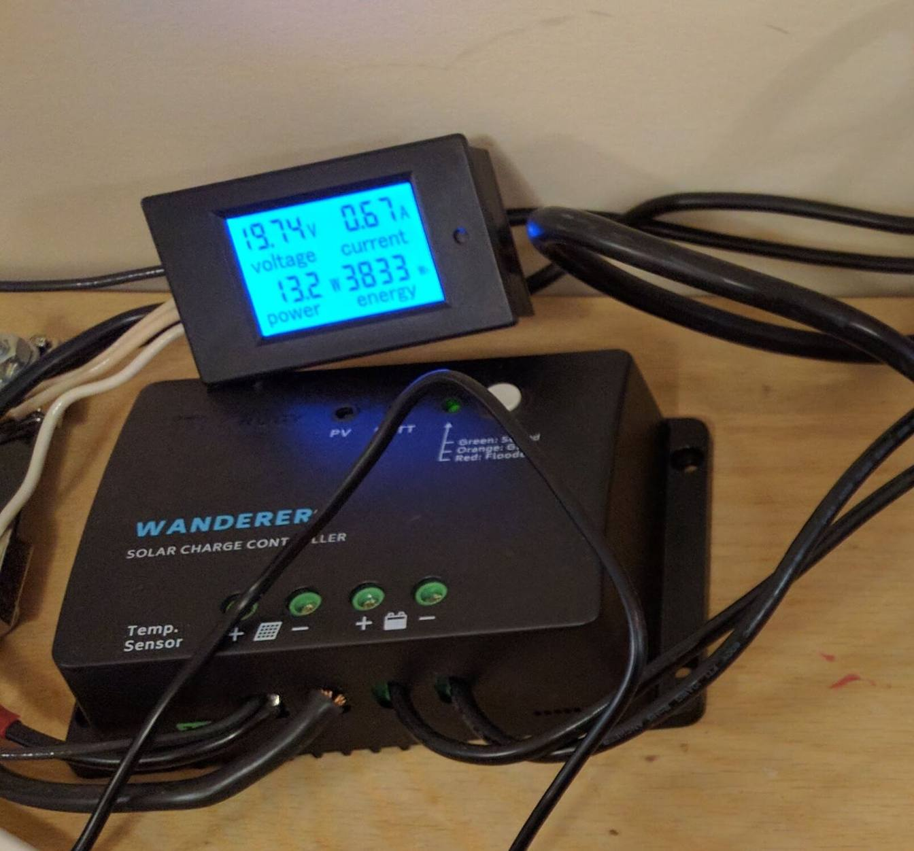
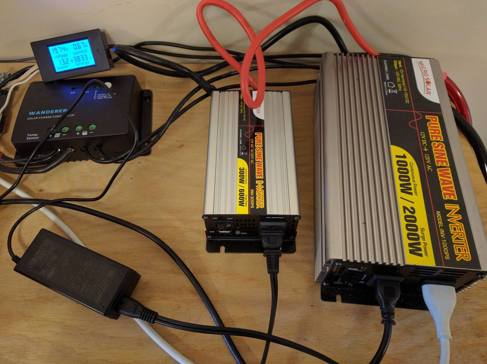

I few weeks ago I decided I would try my hand at a smaller-scale solar system than the one I did for my well (details in a future post).

Overall, this system was well under $1000 and pretty easy to set up.  I'm not sure how practical it is since off-grid systems always cost more than the electricity you save and in a natural disaster situation, I'm not sure powering my work laptop will be top priority for me.

What it does do for me is three things.

1. My workstation is immune to power flickers.  I'm often in meetings with coworkers when power goes out.  This way I can continue working without worrying about losing power.
2. It's great practice for building larger systems.  Many readers of this post are in a position to build one themselves to get started creating their own off-grid solar systems.
3. In a disaster situation, I can use it to charge cell phones, flashlights, fans, etc.  Anything small, but essential can be powered.

## Chose your Voltage

When designing a solar system, you need to decide what DC voltage your system will run at.  This is typically 12v, 24v or 48v.  The most common batteries are large deep-cycle lead-acid batteries (look just like car batteries) and they typically come in 12v configurations.

If you're not interested in the juicy details of why I chose 12v, skip to the next section and go with 12v.  It's good for a small budget-friendly system.

Solar panels, like most DC generating devices, let you choose the volt-to-amp ratio depending on the resistance applied (see [Ohm's Law](https://en.wikipedia.org/wiki/Ohm's_law)).  The data sheet will have an optional voltage for maximum efficiency and lifetime.  When a panel says its nominal wattage is 150w that means that in ideal conditions it can produce 150w of power.  These particular panels like to run at 12v which means `150w / 12v` or about 12.5 amps.

The higher the voltage in a system, the better insulators you need.  High-voltage backbone lines that carry power across the country, for example, can carry hundreds of thousands of volts and will create lightning-like arcs if you get too close.  That's why the power-lines are so high.  Wall power in your house is typically between 120v and 240v (AC) depending on what outlet and where you live.  Power cords for these have a fairly healthy rubber insulation.  But in your laptop power-cord, for example, you'll notice that the part after the brick is *much* smaller.  This is because it's a lower voltage somewhere between 5v and 30v for most electronics.  When dealing with 12v systems, just a couple layers of electrical tape is enough to insulate things.

There are two main problems with low voltages though.

First, as Tesla liked to point out, low voltage DC currents drop voltage very quickly over distance.  The 20 feet or so of wire between my panel and controller is significant enough to cause real losses.  Higher voltage systems with the same overall wattage lose less power over the same distance.

Second, low voltage systems will have high currents with fixed power.  For only 300w in this system it's not a big deal, but for my well system that powers a 0.5hp well pump, it was a real issue.

The higher the current, the thicker the [metal wire you need](https://en.wikipedia.org/wiki/American_wire_gauge) or it will overheat, causing massive losses and possible fires.  Copper isn't that cheap.  Also, small charge-controllers typically don't want more than 30amps of input power so you're limited to 360w for your total system if you go with 12v and a small 30amp controller. (This system was 300w so it was well within that).

The main problem with higher voltage systems is they can be more complex and often cost more.  For example, if I wanted to build a 48v system out of 12v panels and 12v batteries I would need to get them in multiples of 4 so I can wire 4 batteries and 4 panels in series to add up to the 48 volts. (Remember wire in series adds up voltage, wire in parallel adds up current).

Also, charge-controllers and inverters that support the higher voltages tend to cost more since they are designed for larger systems.

On my well pump system, I had to go with at least 24v because of the 800w inputs and the 15,000w max pull from the giant inverter. (Honestly, 24v with giant 00 wires still isn't enough, but I never max out the inverter so it's fine.)

This was a small system not needing more than 300w of solar input so I saved money going with a 12v system.

## The Panels

Alright, enough theory, let's get building.

The most visible part of a solar system externally is the panels.  I decided to go with the Renogy brand I used before on the well system, but decided to go with larger panels since they were slightly cheaper per watt and I could wire fewer panels to get the same wattage.

The workshop/office/bikeshed I built (future article with details) has a large south-facing metal roof.  It's pretty trivial to bolt solar panels on top.  Here in the northern hemisphere, the sun is always towards the south.  Another placement option is west-facing to get the afternoon sun, especially in grid-tie systems that need more power in the evenings.

You want your panels to get maximum direct sunlight, without shadows.  A shadow on the edge of the panel reduces the power of the entire panel, because every cell in the panel produces power equal to the weakest cell.

If you want to get really fancy you can get mounts that let you control the exact angle or even follow the sun.  I was lazy and just bolted them directly on the south facing roof panel.

To install, first bolt on the [mounting brackets](http://amzn.to/2gVgtCq) to each [solar panel](http://amzn.to/2gQvgj2).  This is best done with a [wrench set](http://amzn.to/2gvl69m) since it's hex nut and bolt on both sides and the inner one is hard to reach.

I got a 20' extendable ladder, lifted the panels by myself with screws in pocket and drill clipped to my belt.

I bolted them directly to the roof using the mounting brackets.  I did need to seal the holes a bit since the screws only had a rubber gasket on top and there was a chance water could get in under the brackets and leak into my ceiling.  Next time I'll try harder to get the rubber gasket in contact with the roof where it's needed.  (My wife would like to point out how much easier this might have been if I had gotten a helper...)

Since I had two panels, I wanted to wire in parallel.  The wires that come with the panel are pretty short, but putting them side-by-side with the mounting brackets overlapping, I was just able to join them in parallel using a pair of [y connectors](http://amzn.to/2gQBory).  The side with two connectors goes into both the positive or negative terminals of the two panels.  The single end will go to the wires heading towards the charge controller. See cabling section below for details.

## Batteries

Solar only works when there is direct sunlight and the amount it produces varies greatly.  You need to store all that power when it's at its peak so you can have it later.  Storage is the achilles heel of off-grid solar systems.  Battery tech hasn't advanced much in the last couple of decades.

The current best batteries for home solar storage are still plain old lead-acid; they use the same chemistry as engine starter batteries. It's cheap and fairly safe.  The major downside is it's not a dense chemistry.  This makes the batteries large and heavy.  That's not typically a problem for batteries hidden away in a garage or shed so they are used by anyone on any kind of a budget.

You can get fancier chemistries but for [10x to 50x the price](https://ironedison.com/).  I tried to shop for [Tesla Powerwall](https://www.tesla.com/powerwall), but they never returned my calls.

Make sure you get deep cycle batteries, not starter batteries.  They are optimized for very different workloads.  Car batteries are always full (thanks to the car's alternator constantly charging them) and have huge power draws at startup when you're trying to turn the engine.  Solar batteries have a slower and deeper cycle where they top off during a sunny day and then slowly drain the rest of the time.

I don't recommend the batteries I got from Walmart in the photo above.  They drain very fast and don't appear to have their rated capacity.  For this project I recommend between 200 and 400 amp hours so that you can survive cloudy days.

I do recommend [these batteries](http://amzn.to/2gPvkC7) I got on Amazon for my well house system.  They work great and cost about the same as the WalMart special.  Get 2 or 4 of them and you should be good.

When wiring the batteries, make sure to connect them in parallel with all positive terminals in red and negative in black.  The inverter and charge controller will also be connected in parallel the same way.  The goal is to treat the entire battery bank as a single huge battery.

As far as sizing the wires, they need to be large enough for either incoming currents or outgoing currents, whichever is larger.  For my well, outgoing was much larger and I used some spare cables from that project here.

For this, I thought incoming would be larger since you're only charging about 5 hours a day, but are draining constantly.  The incoming has to be a higher rate right?

Actually it turns out that laptops pull quite a surge when the CPU scales up doing things like compiling large projects. (More on that later in the Inverter section).

Either way, I was safe since I reused my huge wires from the well. I recommend something like [these](http://amzn.to/2gidBQl).  You'll need 1 pair for 2 batteries and 3 pairs for 4 batteries.

Speaking of saftey, [Simon Vetter](https://twitter.com/simon_vetter/status/804980862337040384) reminded me that batteries can eventually fail (sooner if manufacturing had defects) causing internal shorts and possible thermal runaway (aka explosion).  You should probably have fuses on one side of the circuit using something like [these cables](http://amzn.to/2fXiGwj) which have inline fuse slots.

In my setup I have a fuse going to the inverter because I'm reusing cables that came with a different inverter that had the fuse built-in.

## Charge Controller

There are two main DC circuits in a solar system as far as cabling is concerned.  One is the circuit coming in from solar panels to the batteries through the charge controller.  The wires need to be large enough to handle the max current coming from the panels.

If you went for the 300w at 12v system as I did, you need to be able to handle 12.5amps.  Looking at the [awg chart](https://en.wikipedia.org/wiki/American_wire_gauge) it looks like we can get away with [12awg cables](http://amzn.to/2gw6fLZ) coming from the Solar panel.  Make sure to get the ones with MC4 connectors on the solar side and bare wires on the other end to insert into the charge controller.

Then from charge controller to battery get the same thing, but with ring terminals as they tend to be easy to hook to batteries.

The job of a charge controller is to look at the current condition of the battery bank and the power coming off the solar panels and use smart algorithms to decide the perfect ratio of volts to amps to charge the battery efficiently and safely.

For this project I recommend either the [Renogy Wanderer](http://amzn.to/2gidRPc) or the [Renogy Adventurer](http://amzn.to/2gWqgYZ).  Both are PWM-style controllers that can handle up to 30amps of input.  The main difference is the Wanderer is cheaper, but the Adventurer has a display built in and comes with a battery temperature sensor to aid its algorithms for optimal charging.

I bought the cheaper one, but later regretted it because I love having all those displays to see what's going on in my system.

I ended up buying an [external multimeter](http://amzn.to/2gWgGVS) and wiring it to the incoming lines so I could see how much power was coming off my solar panels at any given time.  These can be somewhat tricky to wire up and only show what's going into the controller.  I can't see my battery level other than a red indicator LED on the controller when it's low.

## Using the Power

Now that we have panels, batteries, and a charge controller all cabled together, we want to use that power, right?

The best thing to do is find appliances that consume 12v DC current (typically made for vehicles and RVs) and wire them directly to the batteries.  You can also use a simple wire-to-socket kit like [this](http://amzn.to/2fUyPCB) to expose the batteries like the plug in a car.  There is a whole ecosystem of things that use this port (including phone chargers).

But if you want to power monitors, laptops, and other larger devices that only come with 120v AC cords, you need an inverter.  An inverter contains electronics and transformers to convert 12v/24v/48v DC to 120v/240v AC depending on the model.

I first got a 1000w inverter.  Make sure to get one with pure sine wave output if you're powering anything sensitive or with a motor/compressor.

This worked great and ran my laptop, monitor, cluster of raspberry PIs, and secondary desktop with its own monitor.  The fan never even kicked in.  The main problem was that it had a fairly high idle draw; when it wasn't being used, but was simply turned on providing AC power, it wasted a significant amount of energy.

So I ordered the smaller, 300w version of this inverter. Surely I don't need more than that for my small electronics.

The idle draw was significantly lower and my battery lasted longer with the inverter turned on, but since my load was closer to its capacity the fan would kick on every time my laptop started maxing out a CPU.  It was loud enough to interfere with my meetings and generally drove me crazy.

My compromise was to keep both on my desk and turn them off manually when I left work for the day. Works great!  You can see my macbook and monitor plugged directly into the larger inverter.  The smaller inverter powers my speakers.

## Backup Charger

While I was testing out this system, I kept a normal car battery charger handy.  Originally I had only one solar panel and several days of clouds.  Combine this with the crappy WalMart batteries leaving the large inverter on all night, and they were constantly going dead.  The charger could get me up and going quickly while I still had grid power.

If I had more money to blow on this project I would get a combined inverter-charger like I did for the well.  They are basically giant UPS systems but you have to provide your own batteries.  They charge the batteries automatically when they are low and pull from the batteries when they have plenty of charge.  If you lose grid power, they instantly switch over to battery.  It's pretty nice, but costs a lot more.  Also, they tend to come in large sizes with heavy idle draws.

## Shopping List

Listed here is the recommended setup I would use if I were to do this again from scratch.

- 2x [150w 12v Renogy Solar Panels](http://amzn.to/2gioaCG)
- 2x [Sets of Renogy Z Brackets](http://amzn.to/2gwl54W)
- 1x [Renogy Adventurer Charge Controller](http://amzn.to/2fUslUn)
- 1x [Pair of MC4 Y-Connectors](http://amzn.to/2gPRKmR)
- 1x [Pair of MC4 to plain cables](http://amzn.to/2h3EQSq)
- 1x [Pair of Ring to plain cables](http://amzn.to/2gPSlow)
- 3x [12" 4awg Battery Cable Pairs](http://amzn.to/2gPPUlZ)
- 4x [100AH sealed lead acid batteries](http://amzn.to/2gPOMi2)
- 1x [1000w 12v Pure Sine Wave Inverter](http://amzn.to/2girJc5)

Today with prime pricing, I can purchase this entire set for **$1,077.94**.

I've always said that complete solar systems cost about $3/watt.  This system has a slightly higher battery to solar ratio than I typically do, but we still come out pretty close to that.  This is a 300w system with ample storage, high-quality parts, and right at $1k.

I'm assuming you already have basic mechanical and electrical tools.  If not, I recommend getting a [crimper tool](http://amzn.to/2giurOI) and some [wrenches](http://amzn.to/2h3Hbga).

Let me know if you decide to spring for it.  Think of it as investing in the knowledge of how to build off grid systems without first needing a second mortgage. Getting my current house entirely off-grid would cost about $300,000!  Not going to happen.

Some day I hope to either fix up my current house to consume a fraction of its current electricity and then take it off grid.  That or I'll just build a new one with high efficiency in the core design.  You can be sure I'll write about it all along.

Happy Making!
